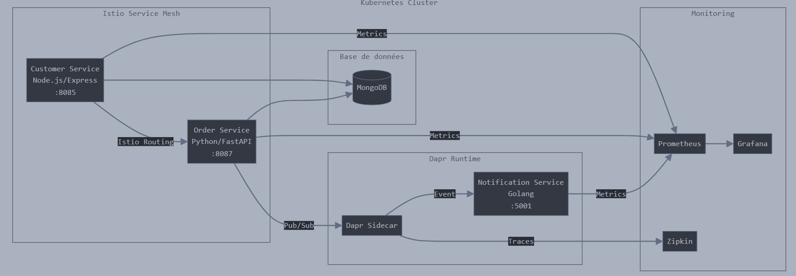

# CRM Microservices System

## 📚 Project Overview
A modern Customer Relationship Management (CRM) system built using a microservices architecture. The project demonstrates practical implementation of microservices concepts using various technologies and programming languages.

## 🎯 Project Goal
The system aims to provide a robust, scalable CRM solution leveraging microservices architecture, demonstrating modern best practices in distributed systems development.

## 🏗️ System Architecture



The system consists of three main microservices interconnected via Dapr and Istio:

### 1. Customer Service
- **Technology**: Node.js/Express
- **Port**: 8085
- **Features**:
  - Customer data management
  - CRUD operations on customer profiles
  - Data validation

### 2. Order Service
- **Technology**: Python/FastAPI
- **Port**: 8087
- **Features**:
  - Order processing
  - Order status tracking
  - Customer service integration

### 3. Notification Service
- **Technology**: Golang
- **Port**: 5001
- **Features**:
  - Real-time notifications
  - Status update tracking

## 🔄 Communication Architecture

### Inter-Service Communication
The system implements a hybrid communication architecture:

#### Dapr (Distributed Application Runtime)
- Event-driven communication between order and notification services
- Pub/sub pattern implementation
- State and secrets management
- Configuration in `./components/pubsub.yaml`

#### Istio Service Mesh
- Traffic management between customer and order services
- Security and observability features
- Intelligent load balancing
- Configuration in `./deploy/destination-rule.yaml` and `./deploy/virtual-service.yaml`

### Infrastructure
- **Kubernetes**: Container orchestration and deployment management
- **Docker Desktop Cluster**: Local development environment

## 💻 Technologies Used

### Languages and Frameworks
- **Customer Service**: Node.js/Express
- **Order Service**: Python/FastAPI
- **Notification Service**: Golang

### Database and Storage
- MongoDB
- Dapr state and secrets persistence

### Infrastructure and Orchestration
- Docker and Docker Compose
- Kubernetes
- Dapr
- Istio Service Mesh

### Monitoring and Observability
- Prometheus
- Grafana
- Dapr tracing

## 🚀 Installation and Deployment

### Prerequisites
```bash
- Docker Desktop with Kubernetes enabled
- Kubectl CLI
- Dapr CLI
- Istio
- Node.js 18+
- Python 3.11+
- Go 1.19+
```

### Infrastructure Setup

1. Kubernetes Cluster Configuration:
```bash
# Check cluster status
kubectl cluster-info
```

2. Dapr Installation:
```bash
# CLI Installation
wget -q https://raw.githubusercontent.com/dapr/cli/master/install/install.sh -O - | /bin/bash

# Initialize on Kubernetes
dapr init -k
```

3. Istio Installation:
```bash
# Download and install
curl -L https://istio.io/downloadIstio | sh -
export PATH=$PWD/bin:$PATH
istioctl install --set profile=demo -y

# Enable automatic injection
kubectl label namespace default istio-injection=enabled
```

### Services Deployment

1. Dapr Configuration:
```bash
# Deploy Dapr components
kubectl apply -f ./components/pubsub.yaml
```

2. Infrastructure Deployment:
```bash
# MongoDB
kubectl apply -f ./deploy/mongodb.yaml

# Services
kubectl apply -f ./deploy/customer-deployment.yaml
kubectl apply -f ./deploy/order-deployment.yaml
kubectl apply -f ./deploy/notification-deployment.yaml

# Istio Configuration
kubectl apply -f ./deploy/destination-rule.yaml
kubectl apply -f ./deploy/virtual-service.yaml
```

3. Deployment Verification:
```bash
# Check pods
kubectl get pods

# Check services
kubectl get svc

# Check Dapr components
dapr list -k
```

## 📡 API Endpoints

### Customer Service (8085)
```
GET    /api/customers            - List customers
GET    /api/customers/:id        - Get customer details
POST   /api/customers            - Create customer
PUT    /api/customers/:id        - Update customer
DELETE /api/customers/:id        - Delete customer
GET    /metrics                  - Prometheus metrics
GET    /health                   - Health check
```

### Order Service (8087)
```
GET    /api/orders               - List orders
GET    /api/orders/:id           - Get order details
POST   /api/orders               - Create order
PUT    /api/orders/:id/status    - Update order status
DELETE /api/orders/:id           - Delete order
GET    /metrics                  - Prometheus metrics
GET    /health                   - Health check
```

### Notification Service (5001)
```
POST   /orders                   - Receive notifications
GET    /health                   - Health check
```

## 📊 Monitoring and Metrics

### Monitoring Tools Setup

1. Deployment:
```bash
# Grafana and Prometheus
kubectl apply -f ./samples/addons/grafana.yaml
kubectl apply -f ./samples/addons/prometheus.yaml
```

2. Dashboard Access:
```bash
# Grafana (http://localhost:3000)
kubectl port-forward svc/grafana 3000:3000

# Prometheus (http://localhost:9090)
kubectl port-forward svc/prometheus 9090:9090
```

### Available Metrics
- Request counters per service
- Inter-service call latency
- Success/failure rates
- Resource utilization
- Custom Dapr metrics

## 👥 Data Structures

### Customer
```json
{
  "id": "string",
  "name": "string",
  "email": "string",
  "phone": "string",
  "address": "string",
  "created_at": "timestamp",
  "updated_at": "timestamp"
}
```

### Order
```json
{
  "id": "string",
  "customer_id": "string",
  "items": [
    {
      "product_name": "string",
      "quantity": "integer",
      "price": "float"
    }
  ],
  "total_price": "float",
  "status": "string",
  "created_at": "timestamp",
  "updated_at": "timestamp"
}
```

## 🔍 Testing

### Running Tests
```bash
# Customer Service
cd customer-service
npm install
npm test

# Order Service
cd order-service
pip install requirement.txt
python -m pytest

# Notification Service
cd notification-service
go mod tidy
go test ./...
```

### Integration Testing
```bash
# Test Dapr communication
dapr run --app-id test-pub --app-port 3000 node app.js

# Test Istio routing
kubectl apply -f ./test/virtual-service-test.yaml
```


## 🤝 Contributing
Contributions are welcome! Please feel free to submit a Pull Request. For major changes, please open an issue first to discuss what you would like to change.

1. Fork the Project
2. Create your Feature Branch (`git checkout -b feature/AmazingFeature`)
3. Commit your Changes (`git commit -m 'Add some AmazingFeature'`)
4. Push to the Branch (`git push origin feature/AmazingFeature`)
5. Open a Pull Request

## 🐛 Bug Reports
Please use the GitHub Issues page to report any bugs or file feature requests.
